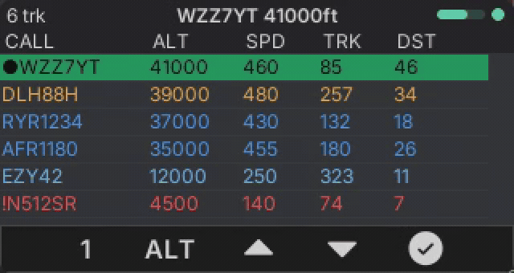
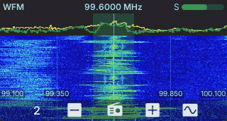

# cardputer-radio

A monorepo of **radio-viewer apps** for the **M5Stack CardputerZero** (Linux ARM64, 320×170 RGB565 display),
built on a shared **LVGL toolkit** extracted from [SDRTerminal](https://github.com/andreahaku/SDRTerminal).
Philosophy: **decode *and* visualize entirely on the device** — an SDR front-end (RTL-SDR / HackRF) plugs
into the CardputerZero, a mature decoder runs as a local process, and each app is a thin **parser + field
mapping** over the common viewer toolkit. See [Planned apps](#planned-apps) for the wider suite.

```
toolkit/        # reusable LVGL shell + radio widgets (PPI/list/detail), entity store, geo, net sources
apps/
  adsb/         # ADS-B 1090 MHz aircraft viewer (dump1090 aircraft.json)
  sdr/          # SDR receiver: spectrum + waterfall, demod (WFM/FM/AM/USB/LSB/CW), rtl_tcp
  meshtastic/   # Meshtastic mesh client (Client API :4403 → local meshtasticd)
```

## Apps

| ADS-B (`apps/adsb`) | SDR (`apps/sdr`) |
| --- | --- |
|  |  |

Both on the desktop SDL simulator at native 320×170; the SDR clip is a **live RTL-SDR Blog V4** WFM
broadcast (the ADS-B clip uses a simulated feed). ADS-B and Meshtastic share a full-width Mercator map
over a **worldwide** coastline + national-border base map (`assets/mapdata/world.rmap`). Per-screen shots
are in each app's README.

| Meshtastic: Map | Meshtastic: Chats | Meshtastic: Node detail |
| --- | --- | --- |
|  |  |  |

- **`radio_toolkit`** (static lib) — the shared foundation: generic app shell (`ShellViewModel` +
  `NavProvider` + `run_app`), a generalized 5-key NavBar and widgets, `geo` (haversine range/bearing + PPI
  projection), a thread-safe `EntityStore` (sparse merge + TTL ageing), and `FileJsonSource` (a resilient
  background file poller). Architecture: [`docs/architecture.md`](docs/architecture.md).
- **`adsb_app`** — dump1090 `aircraft.json` viewer with **four screens** cycled by one key: **List**
  (colour-coded sortable table), **Radar** (north-up scope: aircraft as heading arrows, range rings, side
  callsign lists, trails), **Detail** (selected-aircraft fields + decoded ADS-B status + a mini-radar that
  shares the Radar scope), and **Settings** (persisted). Hex-stable selection, auto-range, an RSSI signal
  bar, a configurable home; runs on a bundled mock `aircraft.json` (no dongle) or a live dump1090 feed.
  → [`apps/adsb/README.md`](apps/adsb/README.md)
- **`sdr_app`** — SDR receiver ported from SDRTerminal onto the toolkit: FFT line chart + scrolling RGB565
  waterfall, S-meter, freq/time grids, passband overlay, manual frequency entry, and audio demod
  (WFM/FM/AM/USB/LSB/CW). Live RTL-SDR via `rtl_tcp` (built with fftw3f + SDL2) or a synthetic mock drives
  the UI; full session state persists across runs. → [`apps/sdr/README.md`](apps/sdr/README.md)
- **`meshtastic_app`** — Meshtastic mesh client. Connects to a local `meshtasticd` daemon via the Client
  API (TCP :4403, framed protobuf). **Five views** on the 5-key NavBar cycle: **Chats** (channel/DM feed,
  channel switcher, canned replies, compose, ACK color-outline), **Nodes** (sortable table + node detail
  sub-screen with HW/SNR/BATT/POS/DIST, DM from detail), **Map** (north-up PPI radar, coloured node dots,
  auto-fit + manual zoom, node selection), **Tools** (live Mesh stats + Packet log, vertical split layout),
  **Settings** (Theme/Long name/Short name/Region/Channel, persisted). No LoRa hardware needed: runs fully
  against a local `meshtasticd -s` simulation. → [`apps/meshtastic/README.md`](apps/meshtastic/README.md)

## Planned apps

The monorepo is a platform for a wider suite — each new app is mostly a **parser + a field mapping** over
the shared toolkit (the radar/list/detail views, entity store, ageing and geo are reused). Planned, in
rough order of work:

| App | Decoder / source | Shape |
| --- | --- | --- |
| **AIS** (marine) | `AIS-catcher` (`ships.json`) | ship radar + list — next, mirrors ADS-B |
| **POCSAG / FLEX** | `multimon-ng` | pager message feed |
| **APRS** | `direwolf` (KISS / AX.25) | station map + message feed |
| **ACARS** | `acarsdec` | aircraft message feed |
| **NOAA APT** | weather-sat pass capture | decoded image gallery |
| **RDS** | in-app DSP (SDR extension) | FM station name / radiotext |
| **Ham digital modes** | ham rig + Hamlib CAT + audio / PTT | CW, FT8/FT4, JS8, PSK/RTTY, WSPR (RX + TX) — the flagship |

The unifying constraint: **decode and visualize entirely on the device** — an SDR / HackRF / ham rig plugs
into the CardputerZero, a mature open-source decoder runs as a local process, and the LVGL app reads its
output over loopback (a local file or `127.0.0.1`).

## Build & run (desktop SDL simulator)
```bash
cmake --preset linux-x86-64                 # configure (first run fetches LVGL 9.5 + nlohmann/json)
cmake --build --preset linux-x86-64-dbg     # → build/linux-x86-64/apps/{adsb,sdr}/Debug/*_app
./build/linux-x86-64/apps/adsb/Debug/adsb_app          # ADS-B viewer (mock data)
./build/linux-x86-64/apps/sdr/Debug/sdr_app            # SDR receiver (mock source; SDR_SOURCE=mock to force)
./build/linux-x86-64/apps/meshtastic/Debug/meshtastic_app  # Meshtastic client (default: 127.0.0.1:4403)
# live ADS-B: run `dump1090 --write-json <dir>` then ADSB_JSON=<dir>/aircraft.json ./.../adsb_app
# centre the radar on you: ADSB_HOME_LAT=.. ADSB_HOME_LON=.. ./.../adsb_app  (default: Bologna, IT)
# point SDR at a real receiver: SDR_RTLTCP=host:port ./.../sdr_app   (needs rtl_tcp running)
```
Architecture and design (shared toolkit, shell decoupling, per-app data paths): see
[`docs/architecture.md`](docs/architecture.md). Per-app docs: [`apps/adsb/README.md`](apps/adsb/README.md),
[`apps/sdr/README.md`](apps/sdr/README.md).

## Hardware & data sources

The apps are **viewers**: a decoder runs as a **local process** and each app reads its output (a local
file, or a `127.0.0.1` socket). Today you start the decoder yourself (each app's README has the exact
command); summary:

| App | Decoder (local process) | App reads | Install (Arch) |
| --- | --- | --- | --- |
| **ADS-B** | `dump1090 --write-json <dir> --write-json-every 1` | `<dir>/aircraft.json` (via `ADSB_JSON`) | `dump1090` |
| **SDR** | `rtl_tcp -a 127.0.0.1 -p 1234 -s 2400000` | raw IQ over TCP `127.0.0.1:1234` | `rtl-sdr` |
| **Meshtastic** | `meshtasticd -s` (sim, no radio) or with a LoRa cap | Client API TCP `127.0.0.1:4403` (via `MESHTASTICD_HOST`/`MESHTASTICD_PORT`) | Docker: `meshtastic/meshtasticd` |

Each app also runs with **no hardware** on bundled mock/synthetic data (ADS-B: the bundled
`aircraft.json`; SDR: `SDR_SOURCE=mock`), so the whole UI works on the desktop simulator without a dongle.

### SDR front-ends

- **RTL-SDR** — supported today: **v3, v4, and compatible R820T2 / R828D dongles**. The **RTL-SDR Blog V4**
  needs the `rtl-sdr-blog` driver (`rtl-sdr` ≥ 2.0). On Linux, **blacklist the kernel DVB driver** so it
  doesn't grab the dongle, then replug:
  ```bash
  echo 'blacklist dvb_usb_rtl28xxu' | sudo tee /etc/modprobe.d/blacklist-rtl.conf
  ```
- **HackRF** — *planned*: wider frequency coverage and TX, wired in through SoapySDR. The apps are
  front-end-agnostic (they consume a decoder's output, not raw IQ), so adding HackRF is mostly decoder /
  source configuration rather than app changes.

### On-device auto-start (planned)

On the desktop you launch the decoder by hand. **On the CardputerZero the goal is a single step:** launch
the app and it starts (and retunes) the background decoder for you, off the on-board RTL-SDR. A
`DecoderSupervisor` in the toolkit will own the dongle, run the right decoder per app, and frequency-hop
when one dongle has to cover multiple bands. Until that lands, start the decoder as shown above.

## License
MIT (matches the SDRTerminal base and the M5Stack template).
