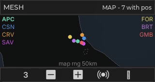

# cardputer-radio

A monorepo of **radio-viewer apps** for the **M5Stack CardputerZero** (Linux ARM64, 320×170 RGB565 display),
built on a shared **LVGL toolkit** extracted from [SDRTerminal](https://github.com/andreahaku/SDRTerminal).
Philosophy: **decode *and* visualize entirely on the device** — an SDR front-end (RTL-SDR / HackRF) plugs
into the CardputerZero, a mature decoder runs as a local process, and each app is a thin **parser + field
mapping** over the common viewer toolkit. See [Planned apps](#planned-apps) for the wider suite.

```
toolkit/        # reusable LVGL shell + radio widgets (PPI/list/detail), raster primitives, entity store, geo, net sources
apps/
  radio/        # the "Radio" hub: one launcher entry that spawns the apps below
  sdr/          # SDR receiver: spectrum + waterfall, demod (WFM/FM/AM/USB/LSB/CW), rtl_tcp
  survey/       # Spectrum survey: wide-band waterfall + PEAKS list (rtl_power/hackrf_sweep) → SDR
  adsb/         # ADS-B 1090 MHz aircraft viewer (dump1090 aircraft.json)
  ais/          # AIS marine vessel viewer (on-device AIVDM decode)
  ism/          # ISM 433/868 MHz device sniffer (rtl_433 -F json: weather, TPMS, remotes)
  meshtastic/   # Meshtastic mesh client (Client API :4403 → local meshtasticd)
device/         # on-device integration (native meshtasticd config for the Cap LoRa-1262)
scripts/        # operator scripts: flashing, device diagnostics, acceptance checks, profiling
```

## Apps

| ADS-B (`apps/adsb`) | SDR (`apps/sdr`) | Meshtastic (`apps/meshtastic`) |
| --- | --- | --- |
|  |  |  |

All on the desktop SDL simulator at native 320×170; the SDR clip is a **live RTL-SDR Blog V4** WFM
broadcast (the ADS-B / Meshtastic clips use simulated feeds). ADS-B and Meshtastic share a full-width
Mercator map over a **worldwide** coastline + national-border base map (`assets/mapdata/world.rmap`) —
key `8` toggles it against the azimuthal PPI radar. Source videos: [ADS-B](apps/adsb/docs/media/demo.mp4),
[Meshtastic](apps/meshtastic/docs/media/demo.mp4). Per-screen shots are in each app's README.

| Meshtastic: Chats | Meshtastic: Node detail | Meshtastic: Tools |
| --- | --- | --- |
|  |  |  |

| Radio hub (`apps/radio`) | Survey (`apps/survey`) | AIS (`apps/ais`) |
| --- | --- | --- |
|  |  |  |

| ISM (`apps/ism`) — live TPMS off-air (RTL-SDR V4) |
| --- |
|  |

- **`radio_toolkit`** (static lib) — the shared foundation: generic app shell (`ShellViewModel` +
  `NavProvider` + `run_app`), a generalized 5-key NavBar and widgets, `geo` (haversine range/bearing + PPI
  projection), the `view::raster` RGB565 primitives + waterfall colormap shared by all the scopes,
  the Mercator vector base map (`map/`), a thread-safe `EntityStore` (sparse merge + TTL ageing), and the
  `FileJsonSource`/`NmeaNetSource` background pollers. Architecture: [`docs/architecture.md`](docs/architecture.md).
- **`radio_app`** — the **hub launcher**: a single "Radio" home-screen entry that lists the suite and
  `posix_spawn`s the chosen app binary, handing the single framebuffer off and reclaiming it on exit.
  → [`apps/radio/README.md`](apps/radio/README.md)
- **`adsb_app`** — dump1090 `aircraft.json` viewer with **four screens** cycled by one key: **List**
  (colour-coded sortable table), **Radar** (north-up scope: aircraft as heading arrows, range rings, side
  callsign lists, trails — or a full-width **Mercator world map**, key `8` toggles), **Detail**
  (selected-aircraft fields + decoded ADS-B status + a mini-radar that
  shares the Radar scope), and **Settings** (persisted). Hex-stable selection, auto-range, an RSSI signal
  bar, a configurable home; runs on a bundled mock `aircraft.json` (no dongle) or a live dump1090 feed.
  → [`apps/adsb/README.md`](apps/adsb/README.md)
- **`sdr_app`** — SDR receiver ported from SDRTerminal onto the toolkit: FFT line chart + scrolling RGB565
  waterfall, S-meter, freq grid, passband overlay, manual frequency entry, and audio demod
  (WFM/FM/AM/USB/LSB/CW) over SDL (desktop) or ALSA (device speaker). Live RTL-SDR via `rtl_tcp` or a
  synthetic mock drives the UI; full session state persists across runs.
  → [`apps/sdr/README.md`](apps/sdr/README.md)
- **`survey_app`** — wide-band **spectrum survey**: sweeps tens-to-hundreds of MHz via `rtl_power` /
  `hackrf_sweep`, shows the waterfall with peak markers, lists the detected peaks (sortable, aged), and
  hands the selected peak off to the SDR app (**Open in SDR**, via `SDR_FREQ`).
  → [`apps/survey/README.md`](apps/survey/README.md)
- **`ais_app`** — AIS marine-traffic viewer, a port of the ADS-B app with an **on-device AIVDM decoder**
  (position types 1/2/3 + static type 5, two-source-oracle tested): List / Radar (PPI) / Mercator map /
  Detail / Settings, vessels coloured by navigation status, live NMEA over UDP/TCP from `rtl_ais` or
  AIS-catcher. → [`apps/ais/README.md`](apps/ais/README.md)
- **`ism_app`** — **ISM-band device sniffer**: lists nearby 433/868 MHz transmissions (weather sensors,
  **TPMS**, remotes) decoded by `rtl_433 -F json`, a port of the ADS-B structure minus the radar (ISM
  devices have no position). List (sortable MODEL/AGE/RSSI) / Detail (all reported fields + extras) /
  Settings; pure parser with a **frozen two-source parity test** over real off-air captures. Runs on a
  local dongle, a networked `rtl_tcp` dongle, a replay file, or a no-hardware mock.
  → [`apps/ism/README.md`](apps/ism/README.md)
- **`meshtastic_app`** — Meshtastic mesh client. Connects to a local `meshtasticd` daemon via the Client
  API (TCP :4403, framed protobuf). **Five views** on the 5-key NavBar cycle: **Chats** (channel/DM feed,
  channel switcher, canned replies, compose, ACK color-outline), **Nodes** (sortable table + node detail
  sub-screen with HW/SNR/BATT/POS/DIST, DM from detail), **Map** (north-up PPI radar **or** a full-width
  Mercator world map — key `8` toggles; coloured node dots, auto-fit + manual zoom, node selection),
  **Tools** (live Mesh stats + Packet log, vertical split layout),
  **Settings** (Theme/Long name/Short name/Region/Channel, persisted). No LoRa hardware needed: runs fully
  against a local `meshtasticd -s` simulation. → [`apps/meshtastic/README.md`](apps/meshtastic/README.md)

## Planned apps

The monorepo is a platform for a wider suite — each new app is mostly a **parser + a field mapping** over
the shared toolkit (the radar/list/detail views, entity store, ageing and geo are reused). Planned, in
rough order of work:

| App | Decoder / source | Shape |
| --- | --- | --- |
| **POCSAG / FLEX** | `multimon-ng` | pager message feed |
| **BLE / device radar** | onboard BT / USB (BlueZ) | geo-radar + list — HW-gated |
| **APRS** | `direwolf` (KISS / AX.25) | station map + message feed |
| **ACARS** | `acarsdec` | aircraft message feed |
| **NOAA APT** | weather-sat pass capture | decoded image gallery |
| **RDS** | in-app DSP (SDR extension) | FM station name / radiotext |
| **Ham digital modes** | ham rig + Hamlib CAT + audio / PTT | CW, FT8/FT4, JS8, PSK/RTTY, WSPR (RX + TX) — the flagship |

The unifying constraint: **decode and visualize entirely on the device** — an SDR / HackRF / ham rig plugs
into the CardputerZero, a mature open-source decoder runs as a local process, and the LVGL app reads its
output over loopback (a local file or `127.0.0.1`).

## Build & run (desktop SDL simulator)
```bash
cmake --preset linux-x86-64                 # configure (first run fetches LVGL 9.5 + nlohmann/json)
cmake --build --preset linux-x86-64-dbg     # → build/linux-x86-64/apps/<app>/Debug/<app>_app
./build/linux-x86-64/apps/radio/Debug/radio_app        # the hub (needs sibling apps built)
./build/linux-x86-64/apps/adsb/Debug/adsb_app          # ADS-B viewer (mock data)
./build/linux-x86-64/apps/ais/Debug/ais_app            # AIS viewer (bundled mock NMEA)
./build/linux-x86-64/apps/sdr/Debug/sdr_app            # SDR receiver (mock source; SDR_SOURCE=mock to force)
./build/linux-x86-64/apps/survey/Debug/survey_app      # spectrum survey (SURVEY_SOURCE=mock for no dongle)
./build/linux-x86-64/apps/ism/Debug/ism_app            # ISM sniffer (ISM_SOURCE=mock for no dongle)
./build/linux-x86-64/apps/meshtastic/Debug/meshtastic_app  # Meshtastic client (default: 127.0.0.1:4403)
# live ADS-B: run `dump1090 --write-json <dir>` then ADSB_JSON=<dir>/aircraft.json ./.../adsb_app
# centre the radar on you: ADSB_HOME_LAT=.. ADSB_HOME_LON=.. ./.../adsb_app  (default: Bologna, IT)
# point SDR at a real receiver: SDR_RTLTCP=host:port ./.../sdr_app   (needs rtl_tcp running)
```

### Tests

The decoders are pure libraries covered by **frozen parity tests** (two independent sources must agree;
the vectors are never edited to make code pass):

```bash
ctest --test-dir build/linux-x86-64 -C Debug --output-on-failure
# aircraft_parse_test (ADS-B) · ais_decoder_test + nmea_net_test (AIS)
# meshtastic_decoder_test · sweep_parser_test (Survey) · ism_parse_test (ISM)
```

Architecture and design (shared toolkit, shell decoupling, per-app data paths): see
[`docs/architecture.md`](docs/architecture.md) and the [docs index](#documentation) below. Each app has
its own README under `apps/<app>/`.

## Hardware & data sources

The apps are **viewers**: a decoder runs as a **local process** and each app reads its output (a local
file, or a `127.0.0.1` socket). Today you start the decoder yourself (each app's README has the exact
command); summary:

| App | Decoder (local process) | App reads | Install (Arch) |
| --- | --- | --- | --- |
| **ADS-B** | `dump1090 --write-json <dir> --write-json-every 1` | `<dir>/aircraft.json` (via `ADSB_JSON`) | `dump1090` |
| **AIS** | `rtl_ais` or `AIS-catcher` | `!AIVDM` NMEA over UDP/TCP (via `AIS_UDP` / `AIS_TCP`) | `rtl-ais` / `ais-catcher` |
| **SDR** | `rtl_tcp -a 127.0.0.1 -p 1234 -s 2400000` | raw IQ over TCP `127.0.0.1:1234` | `rtl-sdr` |
| **Survey** | `rtl_power` / `hackrf_sweep` (spawned by the app itself) | CSV sweep rows on the child's stdout | `rtl-sdr` / `hackrf` |
| **ISM** | `rtl_433 -F json` (spawned by the app itself) | JSON device lines on the child's stdout | `rtl_433` |
| **Meshtastic** | `meshtasticd -s` (sim, no radio) or **native with the Cap LoRa-1262** ([`docs/cap-lora-1262.md`](docs/cap-lora-1262.md)) | Client API TCP `127.0.0.1:4403` (via `MESHTASTICD_HOST`/`MESHTASTICD_PORT`) | Docker: `meshtastic/meshtasticd` |

Each app also runs with **no hardware** on bundled mock/synthetic data (ADS-B: the bundled
`aircraft.json`; SDR: `SDR_SOURCE=mock`; Survey: `SURVEY_SOURCE=mock`; ISM: `ISM_SOURCE=mock`), so the
whole UI works on the desktop simulator without a dongle.

### SDR front-ends

- **RTL-SDR** — supported today: **v3, v4, and compatible R820T2 / R828D dongles**. The **RTL-SDR Blog V4**
  needs the `rtl-sdr-blog` driver (`rtl-sdr` ≥ 2.0). On Linux, **blacklist the kernel DVB driver** so it
  doesn't grab the dongle, then replug:
  ```bash
  echo 'blacklist dvb_usb_rtl28xxu' | sudo tee /etc/modprobe.d/blacklist-rtl.conf
  ```
- **HackRF** — *planned*: wider frequency coverage and TX, wired in through SoapySDR. The apps are
  front-end-agnostic (they consume a decoder's output, not raw IQ), so adding HackRF is mostly decoder /
  source configuration rather than app changes.

### On-device auto-start (planned)

On the desktop you launch the decoder by hand. **On the CardputerZero the goal is a single step:** launch
the app and it starts (and retunes) the background decoder for you, off the on-board RTL-SDR. A
`DecoderSupervisor` in the toolkit will own the dongle, run the right decoder per app, and frequency-hop
when one dongle has to cover multiple bands. Until that lands, start the decoder as shown above.

## Documentation

- [`docs/architecture.md`](docs/architecture.md) — the shared toolkit, MVVM data flow, shell
  decoupling, display backends, per-app data paths.
- [`docs/cap-lora-1262.md`](docs/cap-lora-1262.md) — running a **native `meshtasticd`** on the device
  with the M5Stack **Cap LoRa-1262** (SX1262 + GNSS): hardware map, install, acceptance script.
- [`docs/sdr-device-profile.md`](docs/sdr-device-profile.md) — measured on-device SDR CPU/memory
  profile and the audio (PipeWire/ALSA) wiring.
- [`docs/mapdata-design.md`](docs/mapdata-design.md) — the `.rmap` vector base-map format and build
  pipeline behind the Mercator map layer.
- [`docs/distribution-gap-check.md`](docs/distribution-gap-check.md) — point-in-time packaging /
  distribution gap analysis (`.deb`, AppStore layout).
- [`docs/m5stack-usb-host-followup.md`](docs/m5stack-usb-host-followup.md) — the USB-host hardware
  investigation on the CardputerZero prototype (dated evidence log).
- [`toolkit/README.md`](toolkit/README.md) — the shared `radio_toolkit` modules.
- [`scripts/README.md`](scripts/README.md) — operator scripts (flashing, diagnostics, acceptance).
- [`tools/remote-fb/README.md`](tools/remote-fb/README.md) — the headless remote-framebuffer viewer
  used for development and screenshots.

## License
MIT (matches the SDRTerminal base and the M5Stack template).
