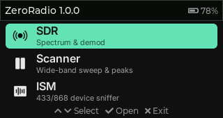
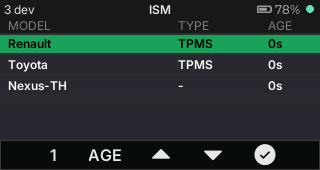
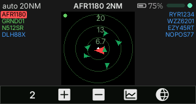
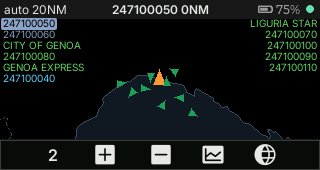

# ZeroRadio

Radio tools for the M5Stack CardputerZero. Plug an RTL-SDR dongle into the USB-A port and ZeroRadio turns the CardputerZero into a pocket receiver: listen to a frequency, scan a band for activity, sniff 433/868 MHz sensors, and track aircraft and ships on a map. Every decoder runs on the device. No computer or network is needed.

| Hub | SDR | Scanner |
| --- | --- | --- |
|  |  |  |

| ISM | ADS-B | AIS |
| --- | --- | --- |
|  |  |  |

## Apps

ZeroRadio is one entry in the CardputerZero launcher. It opens a hub that starts the apps below, one at a time.

| App | What it does | Decoder on the device |
| --- | --- | --- |
| **SDR** | Spectrum, waterfall and audio: WFM, FM, AM, USB, LSB, CW. Frequency entry, zoom, band presets. | `rtl_tcp` |
| **Scanner** | Sweeps a wide band, lists the strongest signals, and opens one in the SDR app. | `rtl_power` / `hackrf_sweep` |
| **ISM** | Lists 433/868 MHz devices: weather sensors, tyre pressure sensors, remotes. | `rtl_433` |
| **ADS-B** | Aircraft list, radar and world map at 1090 MHz. | `readsb` (bundled) |
| **AIS** | Ship list, radar and world map at 162 MHz. | `AIS-catcher` (bundled) |

Each app starts its decoder when it opens and stops it when it closes, so the next app finds the dongle free.

## Hardware

- An M5Stack CardputerZero, hardware V0.6 or later (USB host on the USB-A port).
- An RTL-SDR dongle, for example the RTL-SDR Blog V4, with an antenna for the band you use.
- Optional: a GPS for your position, either the M5Stack Cap LoRa-1262-GPS or a USB GPS receiver.

The dongle draws a lot of power. Every app shows the battery level in its header.

## Install

From the CardputerZero AppStore, install **ZeroRadio**. To install a package by hand:

```bash
sudo apt install ./zeroradio_1.0.0_arm64.deb
```

The package pulls its Debian dependencies (`rtl-sdr`, `rtl-433`, `hackrf`, `pipewire-alsa` and the shared libraries) and installs everything under `/usr/share/zeroradio`.

## Use

Open **ZeroRadio** from the launcher, move with F/X and press Enter to open an app. The last row, **About**, shows the version, the source code link with a QR code, the changelog and the credits.

Inside every app:

| Key | Action |
| --- | --- |
| 4 | Next tool page |
| 5, 6, 7, 8 | The four actions shown in the bottom bar |
| F / X | Move the cursor in a list or in Settings |
| H | Help for this app |
| TAB | Switch between SDR and Scanner |
| Esc | Back to the hub |
| Hold Esc 3 s | Back to the CardputerZero launcher |

**Your position.** ADS-B and AIS centre their radar and map on your position. Set it once in Settings > Location of either app. Type a city name, type coordinates such as `35.90, 14.51`, or pick the GPS row. The position is shared by the whole suite.

**Sunlight.** Settings > Theme > Light gives a light radar and map with dark lines.

## Build from source

The desktop simulator runs the apps in a 320x170 SDL window:

```bash
cmake --preset linux-x86-64
cmake --build --preset linux-x86-64-dbg
./build/linux-x86-64/apps/radio/Debug/radio_app          # the hub
ADSB_SOURCE=mock ./build/linux-x86-64/apps/adsb/Debug/adsb_app
```

Without a dongle, run the apps on sample data: `SDR_SOURCE=mock`, `SURVEY_SOURCE=mock`, `ISM_SOURCE=mock`, `ADSB_SOURCE=mock`, `AIS_SOURCE=mock`.

The device build runs in a Debian trixie container, so the binaries match the CardputerZero system libraries. It needs Docker:

```bash
scripts/cp0-docker-build.sh               # device binaries in build/cp0-trixie
scripts/cp0-docker-build.sh --package     # build/cp0-trixie/zeroradio_<version>_arm64.deb
```

Run the tests on the desktop build:

```bash
ctest --test-dir build/linux-x86-64 -C Debug --output-on-failure
```

## Repository layout

```
toolkit/          shared library: app shell, keys, themes, map, location, sources, help viewer
apps/radio/       the hub
apps/sdr/         SDR
apps/survey/      Scanner
apps/ism/         ISM
apps/adsb/        ADS-B
apps/ais/         AIS
apps/meshtastic/  Meshtastic client (not in the 1.0.0 package, see its README)
docs/help/        the in-app help pages
docker/           the device build container
cmake/            toolchain and the bundled decoders
assets/           fonts, icons, world map, city list
tools/            map and city list generators, remote framebuffer viewer
```

## Documentation

- [`docs/architecture.md`](docs/architecture.md): the toolkit, data flow and display backends.
- [`docs/publishing.md`](docs/publishing.md): how to build, check and submit the package to the AppStore.
- [`docs/mapdata-design.md`](docs/mapdata-design.md): the vector map format and its generator.
- [`docs/sdr-device-profile.md`](docs/sdr-device-profile.md): SDR CPU and memory on the device, audio routing.
- [`docs/cap-lora-1262.md`](docs/cap-lora-1262.md): the Cap LoRa-1262 with a native `meshtasticd`.
- Each app has a README in `apps/<app>/`, and `toolkit/README.md` describes the shared modules.

## Roadmap

New apps are mostly a parser plus a field mapping over the toolkit. Candidates: POCSAG/FLEX pagers (`multimon-ng`), APRS (`direwolf`), ACARS (`acarsdec`), NOAA APT images, FM RDS, and ham digital modes.

## Credits and license

ZeroRadio is made by Andrea Salvatore (IU4APC) and released under the MIT License. It started from the M5Stack CardputerZero app template. The package bundles readsb and AIS-catcher (GPL-3.0) as separate programs. [`CREDITS.md`](CREDITS.md) lists every third-party component, data set and font with its license.
