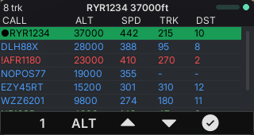
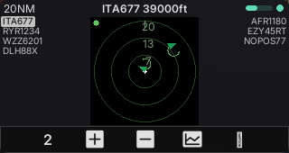
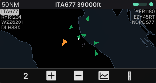
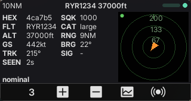
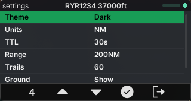

# ADS-B — a live aircraft radar for the M5Stack CardputerZero (`apps/adsb`)

The **ADS-B** app is part of **ZeroRadio 1.0.0**. It turns the
[M5Stack CardputerZero](https://docs.m5stack.com/) (a Linux ARM64 handheld with a 320×170 RGB565
display and a physical keyboard) into a pocket **live aircraft viewer**. It has a sortable traffic
**list**, a north-up **radar** scope, a per-aircraft **detail** view and saved **settings**. A bundled
[readsb](https://github.com/wiedehopf/readsb) decoder reads an RTL-SDR dongle on 1090 MHz.

It is a graphical [LVGL](https://lvgl.io/) application built on the shared **`radio_toolkit`** (the
reactive MVVM shell and widgets shared with the other ZeroRadio apps). `readsb` decodes, and the app
polls the `aircraft.json` file it writes. Development runs on a desktop **SDL simulator** at the
device resolution (320×170).


> The full-width **Mercator map** on the SDL simulator at native 320×170: aircraft as heading arrows
> over a worldwide coastline + national-border base map, with position trails and transparent
> callsign columns (selected aircraft inverted). Key `8` toggles between this map and the azimuthal
> PPI radar. (Simulated feed around the home position.)

## Features

- **Four screens, one key** — **List** (colour-coded, sortable traffic table), **Radar** (north-up
  PPI scope), **Detail** (selected-aircraft fields, decoded status and a mini-radar) and **Settings**.
  Key `4` cycles the screens, and the other four keys act on the current one.
- **North-up radar scope** — three range rings with NM labels, a north tick and a home dot at the
  centre. Each positioned aircraft is a **heading arrowhead**, coloured by category (selected one
  orange and larger, emergency red), with optional position **trails** and side callsign lists.
  `render_scope()` draws it into an RGB565 canvas that the Radar and the Detail mini-radar share.
- **Radar ↔ map toggle** — key `8` on the Radar screen (and the "Map view" setting) switches the
  scope between the azimuthal **radar** and a **Mercator map**. The map draws land, sea, coastline
  and borders (Natural Earth, bundled as `assets/mapdata/*.rmap`) under the aircraft, centred on
  the home position. In map mode the canvas runs full-width, and the callsign columns overlay it.
  The Light theme switches the radar and map to a daylight palette. The `toolkit/src/map` renderer
  is shared with the AIS and Meshtastic apps.
- **Auto / manual range** — a range ladder (5/10/20/50/100/200 NM) plus an **AUTO** state that fits
  the outer ring to the farthest aircraft. Zoom from the Radar or Detail page.
- **Category colours** — light (green), small (cyan), large (blue), heavy (orange), rotorcraft
  (purple), other (grey). An **emergency squawk** (7500/7600/7700) turns the aircraft red.
- **Hex-stable selection** — a moving **cursor** (list highlight) and a locked **selection** (the
  Detail/Radar focus, marked ● in the list). The app tracks both by ICAO hex, so re-sorts keep them.
- **Decoded status** — the Detail view spells out HIJACK 7500 / RADIO FAIL 7600 / EMERGENCY 7700 /
  ON GROUND / nominal, with range, bearing, altitude, speed, track, squawk, category and RSSI.
- **Signal + connection feedback** — a header RSSI bar from the strongest contact and a connection
  dot that tracks the feed.
- **Persistence** — the app saves every preference on change (atomic write) to
  `~/.config/zeroradio/adsb/settings` and restores it on the next launch.

## Home position

The radar centres on one home position that the whole suite shares. Set it once in
**Settings > Location** (ADS-B or AIS):

- type a city name, matched against an offline GeoNames list,
- type coordinates as `lat, lon`,
- or pick the GPS row, fed by a USB GPS receiver or the Cap LoRa-1262-GPS shield.

The app saves it in `~/.config/zeroradio/location`. `ADSB_HOME_LAT` / `ADSB_HOME_LON` override the
saved location for one run. Without a home position, range and bearing are wrong.

## How it works

**The data path.** The RTL-SDR dongle sits in the CardputerZero USB-A port. On start, the app launches
its bundled `readsb`, which decodes 1090 MHz ADS-B and writes an `aircraft.json` snapshot every
second into a private runtime directory. The app stops `readsb` on exit. `FileJsonSource` polls the
file on a background thread (every 2 s), parses it and merges each aircraft into a thread-safe
`EntityStore`. The UI never blocks on I/O.

1. **Parse + merge** — `parse_aircraft_json` turns each record into an `Aircraft` (it tolerates
   missing fields and never throws). `apply_to_store` merges it into the store, keyed by ICAO
   **hex**. The app drops a position older than the TTL (`seen_pos`), so the radar stops plotting
   a stale spot.
2. **Snapshot + render** — an LVGL timer (~300 ms) takes a store snapshot, expires stale aircraft,
   builds a sorted row set, records trails and refreshes the active screen.

**What you see.** The header shows screen-specific info on the left (traffic count, range), the
selected aircraft's callsign and sort value in the centre, and an RSSI bar and connection dot on
the right. The body shows one of the four screens.

## Screenshots

| List | Radar | Map | Detail | Settings |
| --- | --- | --- | --- | --- |
|  |  |  |  |  |

Native 320×170 (the device resolution). The List uses category colours (emergency red). The Radar
is a north-up scope with range rings. The Map is the full-width Mercator view (key `8` toggles
Radar↔Map). The Detail pairs the aircraft fields with a mini-radar. Settings is a name/value list.

## Quick start

On the CardputerZero, plug the RTL-SDR into the USB-A port and open **ADS-B** from the ZeroRadio hub.
The `zeroradio` `.deb` ships `readsb`.

On the desktop SDL simulator, the app looks for `readsb` next to its binary, then on `PATH`:

```shell
# Build the monorepo simulator (from the repo root)
cmake --preset linux-x86-64
cmake --build --preset linux-x86-64-dbg

# Plug the dongle and run: the app starts readsb itself
./build/linux-x86-64/apps/adsb/Debug/adsb_app

# No dongle: the bundled sample aircraft.json
ADSB_SOURCE=mock ./build/linux-x86-64/apps/adsb/Debug/adsb_app
```

Environment overrides:

| Variable | Effect |
| --- | --- |
| `ADSB_SOURCE=mock` | Read the bundled sample `aircraft.json` instead of starting `readsb`. |
| `ADSB_JSON=/path/aircraft.json` | Read this `aircraft.json` (e.g. from a `dump1090` or `readsb` elsewhere) instead of starting `readsb`. |
| `ADSB_HOME_LAT`, `ADSB_HOME_LON` | Radar home position. Overrides the saved location. |
| `ADSB_TTL=<seconds>` | Drop an aircraft this long after its last update (default `30`). |

## Controls

The bottom NavBar maps the five physical keys `4`–`8` to five slots. The **leftmost key (`4`)
cycles the screen** (List → Radar → Detail → Settings) and shows the page number.

| Key | List | Radar | Detail | Settings |
| --- | --- | --- | --- | --- |
| `4` | screen switch | screen switch | screen switch | screen switch |
| `5` | **cycle sort** (CALL/DST/SPD/ALT/TRK) | zoom in | zoom in | setting ▲ |
| `6` | previous aircraft (▲) | zoom out | zoom out | setting ▼ |
| `7` | next aircraft (▼) | trails on/off | trails on/off | change value |
| `8` | select / deselect (✓) | **radar ↔ map** toggle | **show others** on/off | quit |

The **Settings** screen has nine rows: Theme, Units (NM/km), TTL (15/30/60/120 s), Range (ladder +
AUTO), Trails (All/15/30/60 points), Ground (show/hide), Emerg only (on/off), Map view (Map/Radar)
and Location.

Global keys, shared by every ZeroRadio app:

- `Esc` — back to the hub. Hold `Esc` for 3 s to return to the system launcher.
- `H` — open the in-app help ([`docs/help/adsb.md`](../../docs/help/adsb.md)).
- `F`/`X` (up/down) — move the List and Settings cursors.

## Architecture

Reactive MVVM with a one-way data flow. The UI observes LVGL *subjects* and never reads state
directly. The shared `radio_toolkit` provides the shell (key routing, NavBar, BaseScreen, reactive
bindings, theme, assets, run loop), the `EntityStore`, `FileJsonSource`, `ChildService` and the `geo`
helpers. Only the ADS-B pieces live in this app.

```
input (keys 4-8) → key router (toolkit) → NavBar slot → NavProvider::nav_activate(page,slot)
                                                          → AdsbViewModel action → subject / saved settings

live data (independent of input):
   RTL-SDR ──USB──▶ readsb (ChildService) ──aircraft.json──▶ FileJsonSource (reader thread, ~2 s poll)
                                                   └─ parse_aircraft_json ─▶ apply_to_store ─▶ EntityStore (mutex)
   lv_timer (~300 ms) → AdsbScreen::tick(): sweep TTL, snapshot, sort, record trails, draw active screen
```

ADS-B-specific files (`apps/adsb/src/`):

- **`model/aircraft.{h,cpp}`** — the `aircraft.json` parser (`Aircraft` struct and a tolerant,
  non-throwing JSON parse) and `apply_to_store`, the sparse merge into the generic `EntityStore`.
  It builds as the `adsb_decoder` static lib, and a frozen parity test covers it
  (`test/aircraft_parse_test.cpp`, CTest target `aircraft_parse_test`). One canonical document pins
  every field branch: number/`"ground"`/absent `alt_baro`, the three emergency squawks vs a
  near-miss, track wraparound (incl. exactly 360°), out-of-range positions, category-code mapping
  and the missing-`hex` skip.
- **`viewmodel/adsb_viewmodel.{h,cpp}`** — app state (current screen, sort, range ladder/AUTO,
  cursor vs locked selection, view toggles), the Settings model with persistence, and the
  `NavProvider` key mapping, on the toolkit's `ShellViewModel`.
- **`view/adsb_screen.{h,cpp}`** — the four screens and the `render_scope()` RGB565 renderer (rings,
  NM labels, heading arrows, trails) on the shared `view::raster` primitives, plus the tables,
  header and indicators, on the toolkit's `BaseScreen`.
- **`main.cpp`** — wiring: load the saved location, apply the env overrides, choose the source
  (bundled `readsb`, `ADSB_JSON` or mock), start the poller and run the toolkit app loop.

## Build

CMake ≥ 3.31, C++17. The only extra dependency is **nlohmann/json** (header-only). CMake uses the
system package if present and otherwise fetches `v3.11.3`.

```shell
cmake --preset linux-x86-64
cmake --build --preset linux-x86-64-dbg   # → build/linux-x86-64/apps/adsb/Debug/adsb_app
# release: cmake --build --preset linux-x86-64-rel
```

> **Editor note:** clang in the editor may report false positives (`lvgl.h not found`, `lv_subject_t
> unknown`, `entity_store.h not found`) because it does not see CMake's include paths.
> `cmake --build` is the source of truth.

Device builds run in a Debian trixie container (preset `cp0-trixie`), which also builds the bundled
`readsb`. `scripts/cp0-docker-build.sh --package` produces the `zeroradio` `.deb`, which installs
to `/usr/share/zeroradio`.

## Roadmap

- Decoder settings (gain, ppm, bias-tee) on the Settings screen, passed to the bundled `readsb`.
- HackRF front-end (via SoapySDR), in addition to RTL-SDR (v3/v4 work today).

## License

MIT. See the repo `assets/` folder for third-party asset license notes.
