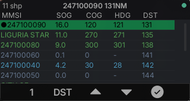
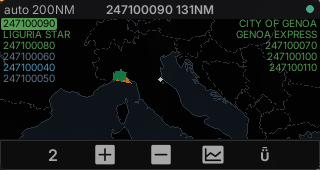
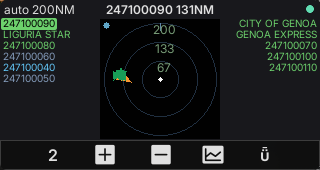
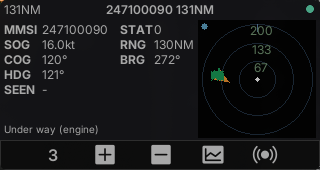

# AIS — marine traffic viewer for the M5Stack CardputerZero (`apps/ais`)

The **AIS** app is part of **ZeroRadio 1.0.0**. It shows nearby ships on the
[M5Stack CardputerZero](https://shop.m5stack.com/pages/m5-cardputerzero) from their **AIS** (Automatic Identification
System) broadcasts, the way `apps/adsb` shows aircraft. It shares the toolkit with ADS-B (reactive
MVVM shell, `EntityStore`, SDL simulator / device backends) and adds its own decoder and field
mapping. It has the same **List / Radar (PPI) / Mercator map / Detail / Settings** screens.

## Screenshots

| List (sortable) | Mercator map | Radar (PPI) | Detail |
| --- | --- | --- | --- |
|  |  |  |  |

Captured from the desktop SDL simulator at native 320×170 with the bundled sample NMEA (vessels
along the Ligurian coast). Key `4` cycles the screens and key `8` toggles map ↔ radar. The side
columns show the vessel names or MMSIs, coloured by navigation status.

## How it works

The RTL-SDR dongle sits in the CardputerZero USB-A port. On start, the app launches a bundled
[AIS-catcher](https://github.com/jvde-github/AIS-catcher) with `-X off`, so it never shares received
data with the aiscatcher.org feed. AIS-catcher demodulates both AIS channels (161.975 MHz and
162.025 MHz) and sends `!AIVDM` NMEA sentences to UDP `127.0.0.1:10110`. The app stops it on exit.

The app's own job is to **decode each `!AIVDM` sentence** into a `Vessel` and merge it into the
shared `EntityStore`, keyed by MMSI.

```
RTL-SDR --> AIS-catcher (GMSK/HDLC/CRC/armor) --UDP !AIVDM--> [ais_app] parse_aivdm --> EntityStore --> view
```

| Layer | File | Notes |
|---|---|---|
| **Decoder** | `src/decoder/ais_decoder.{h,cpp}` | `parse_aivdm()` + `Vessel`, plus `AivdmReassembler` (multi-fragment type 5) and `ship_type_label()`. Pure C++ (std only), so the unit test links it on its own. |
| Model map | `src/model/vessel_store.{h,cpp}` | `apply_nmea()` (reassembler + per-line decode) and `apply_to_store()`, a sparse field bag keyed by MMSI. |
| Source | `toolkit::NmeaNetSource` or `toolkit::FileJsonSource` | receives `!AIVDM` lines over UDP/TCP and reassembles fragments split across datagrams, or polls a file of NMEA lines. |
| ViewModel / View | `src/viewmodel/ais_viewmodel.*`, `src/view/ais_screen.*` | List / Radar / Mercator map / Detail / Settings with the ADS-B 5-key nav. The list sorts by MMSI/DST/SOG/COG (default DST). Colours follow the **navigation status**, and the marker points along **COG**. The Detail decodes the nav-status text, ship type and destination. |

A vessel with no position fix is listed with `-` and never plotted.

## Home position

The radar centres on one home position that the whole suite shares. Set it once in
**Settings > Location** (AIS or ADS-B):

- type a city name, matched against an offline GeoNames list,
- type coordinates as `lat, lon`,
- or pick the GPS row, fed by a USB GPS receiver or the Cap LoRa-1262-GPS shield.

The app saves it in `~/.config/zeroradio/location`. `AIS_HOME_LAT` / `AIS_HOME_LON` override the
saved location for one run.

## Controls

Key `4` cycles List → Radar → Detail → Settings. Keys `5`–`8` act on the current screen, as in ADS-B:

- List: `5` next sort, `6`/`7` previous/next vessel, `8` lock/unlock the cursor vessel.
- Radar: `5`/`6` zoom in/out (up to AUTO), `7` trails on/off, `8` radar ↔ map.
- Detail: `5`/`6` zoom in/out, `7` trails on/off, `8` show other traffic on/off.
- Settings: `5`/`6` previous/next row, `7` change the value, `8` quit.

The **Settings** screen has seven rows: Theme, Units, TTL, Range, Trails, Map view and Location. The
Light theme switches the radar and map to a daylight palette. The app saves the settings to
`~/.config/zeroradio/ais/settings`.

Global keys, shared by every ZeroRadio app:

- `Esc` — back to the hub. Hold `Esc` for 3 s to return to the system launcher.
- `H` — open the in-app help ([`docs/help/ais.md`](../../docs/help/ais.md)).
- `F`/`X` (up/down) — move the List and Settings cursors.

## The decoder

**Position reports (types 1/2/3):** `parse_aivdm()` decodes the **Common Navigation Block**
(ITU-R M.1371-6, Table 46), 168 bits:

| Field | Bits | Decode |
|---|---|---|
| Message type | 0–5 | must be 1, 2 or 3 |
| MMSI | 8–37 (30) | unsigned |
| Nav status | 38–41 (4) | 0–15 (15 = not defined) |
| SOG | 50–59 (10) | ×0.1 kt; 1023 → not available |
| Longitude | 61–88 (28, **signed**) | two's-complement ÷ 600000 °; 181° → not available |
| Latitude | 89–115 (27, **signed**) | two's-complement ÷ 600000 °; 91° → not available |
| COG | 116–127 (12) | ×0.1 °; ≥3600 → not available |
| Heading | 128–136 (9) | 0–359; 360–510 reserved / 511 n/a → not available |

**Static and voyage data (type 5)** arrives in two fragments. `AivdmReassembler` joins them before
the decode, which yields name, callsign, ship type and destination.

6-bit ASCII de-armoring: `v = c − 48; if (v > 40) v −= 8`. The decoder rejects the illegal
`'X'`–`'_'` gap. It verifies the NMEA checksum (XOR between `!` and `*`) and rejects malformed or
truncated sentences. "Not available" sentinels map to `has_*` flags, never to a bogus 181° or 1023
value, like ADS-B's `Aircraft`.

## Tests — the immutable oracle

`test/ais_decoder_test.cpp` is the reward verifier. Each expected value comes from a field set
encoded with `pyais`, then decoded by **both** `gpsdecode` **and** `pyais`. The two decoders had to
agree. The vectors cover the classic decode traps:

- positive (N/E) and **negative (S/W)** coordinates → two's-complement on lat (27b) + lon (28b)
- SOG/COG scaling (1/10 kt, 1/10 °)
- **message type 3** (shared dispatch)
- the **not-available sentinels** (lon 181°, lat 91°, SOG 1023, COG 3600, HDG 511)
- a real-world canonical sentence (gpsd docs, negative longitude)
- both 6-bit de-armor branches, plus negative tests (truncated payload, armor-gap char)

`test/nmea_net_test.cpp` covers the UDP/TCP source.

```bash
cmake --preset linux-x86-64 && cmake --build --preset linux-x86-64-dbg
ctest --test-dir build/linux-x86-64 -C Debug --output-on-failure   # ais_decoder_test
```

## Run

On the CardputerZero, plug the RTL-SDR into the USB-A port and open **AIS** from the ZeroRadio hub.
The `zeroradio` `.deb` ships AIS-catcher. On the desktop, the app looks for `AIS-catcher` next to
its binary, then on `PATH`:

```bash
./build/linux-x86-64/apps/ais/Debug/ais_app              # starts AIS-catcher on the local dongle
AIS_SOURCE=mock ./build/.../ais_app                       # the bundled sample NMEA
AIS_NMEA=/path/to/stream.nmea ./build/.../ais_app         # poll a file of !AIVDM lines
AIS_UDP=10110 ./build/.../ais_app                         # bind a UDP port fed by an external decoder
AIS_TCP=127.0.0.1:4001 ./build/.../ais_app                # connect to a TCP NMEA feed
```

With `AIS_UDP`, `AIS_TCP`, `AIS_NMEA` or `AIS_SOURCE=mock` set, the app starts no decoder.
`AIS_TTL=<seconds>` sets how long a silent vessel stays listed.

Device builds use `scripts/cp0-docker-build.sh` (Debian trixie container, preset `cp0-trixie`),
which also builds the bundled AIS-catcher. `scripts/cp0-docker-build.sh --package` produces the
`.deb`, which installs to `/usr/share/zeroradio`.

## Follow-ups

- **Type 24 (Class B static)** — Class B transponders (small craft) send name and type in type 24
  part A/B, not type 5. Decoding it would name those vessels too. The Detail does not show
  dimensions, ETA or draught from type 5 yet.
- **AIS-specific additions** — CPA/TCPA, MMSI-flag (country) lookup.
