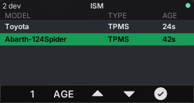
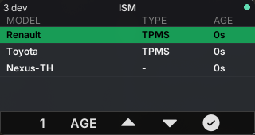
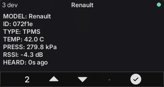
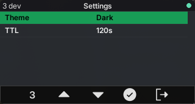
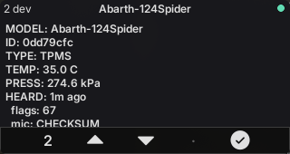

# ISM — 433/868 MHz device sniffer for the M5Stack CardputerZero (`apps/ism`)

The **ISM** app lists nearby ISM-band device transmissions — weather sensors, **TPMS**
(tyre-pressure monitors), remotes, energy meters — decoded by
[`rtl_433`](https://github.com/merbanan/rtl_433). It is a **port of the ADS-B app** minus the
radar: ISM devices have no position, so the screens are **List / Detail / Settings**. Same shared
toolkit (reactive MVVM shell, `EntityStore`, SDL simulator / device backends), a different decoder
and field mapping. See the design docs (`10` / `10b`) in the companion planning repo.



> The List at native 320×170 (desktop SDL simulator), driven by a real **RTL-SDR Blog V4** at
> 433.92 MHz: two car TPMS decoded off-air as they passed. Key `8` locks a device for the Detail
> screen; the source dot (top-right) turns green once `rtl_433` is decoding.

## Status

Working (verified on the desktop SDL simulator, both presets host + cp0 aarch64):

- **Pure decoder** — `parse_ism_json_line` (`src/model/ism_reading`) turns one `rtl_433 -F json`
  line into an `IsmReading` (model, id, channel, type, temp/hum/pressure/battery/rssi/snr/freq, and
  any unmapped scalar fields as `extras`), keyed by a stable `device_key()` (`model[/id][@channel]`).
  Pressure is normalized to kPa (`pressure_PSI` converted). Built as the `ism_decoder` static lib and
  covered by a **frozen two-source parity test** (`test/ism_parse_test.cpp`, CTest target
  `ism_parse_test`): a python oracle (`test/gen_ism_vectors.py`) independently implements the
  documented contract, and the vectors include **real transmissions captured off-air** with the V4
  (`test/ism_capture.jsonl`) alongside the synthetic branch/negative cases.
- **Live source** — `IsmSource` (`src/source/`) spawns `rtl_433 -F json` on a worker thread through
  the shared `toolkit::Subprocess`, buffers partial lines, decodes each into the `EntityStore`, and
  respawns with backoff if the tool exits.
- **List** — a themed `lv_table` (MODEL / TYPE / AGE) with a green cursor band (keys ▲/▼), the locked
  device marked, sortable (key `5`: MODEL / AGE / RSSI), title shows the live device count.
- **Detail** — key `8` locks the cursor device; the Detail screen shows every reported field with
  units plus the `extras`, and the last-heard age.
- **Settings** — a 2-column name|value table (Theme, TTL) with the same cursor band; key `7` cycles
  the focused value. Persisted to `~/.config/cardputer_radio/ism/settings`.

## Screenshots

| List | Detail | Settings |
| --- | --- | --- |
|  |  |  |

The List/Detail/Settings above use the built-in mock source; the banner and the live Detail below
are a real RTL-SDR V4 at 433.92 MHz.

| Live Detail — real Abarth TPMS (PSI→kPa, extras) |
| --- |
|  |

## Run

```bash
cmake --preset linux-x86-64
cmake --build --preset linux-x86-64-dbg --target ism_app
./build/linux-x86-64/apps/ism/Debug/ism_app          # spawns `rtl_433 -F json` on a local dongle
```

Environment:

- `ISM_SOURCE=mock` — synthetic readings (a weather sensor + two TPMS), no tool/hardware needed.
- `ISM_JSON=/path/stream.jsonl` — replay newline-delimited `rtl_433` JSON from a file.
- `ISM_SOURCE=rtl_tcp:<host>:<port>` — read a networked dongle (`rtl_433 -d rtl_tcp:host:port`),
  the capture-on-host model shared with the SDR/ADS-B apps.
- `ISM_RTL433_ARGS="-f 868M"` — extra args appended to the `rtl_433` command (e.g. tune 868 MHz).

`rtl_433` opens the dongle directly — don't run a second `rtl_433`/`rtl_power` against the same
device at once. On Linux, blacklist the kernel DVB driver (`dvb_usb_rtl28xxu`) so it doesn't grab
the dongle (see the root README).

## Testing

```bash
ctest --test-dir build/linux-x86-64 -C Debug -R ism_parse_test
```

The parser test is the frozen reward: it is not edited to make code pass. Regenerate the vectors
(e.g. to add a new captured line to `test/ism_capture.jsonl`) with `python3 test/gen_ism_vectors.py`.

## License

MIT. See the repo `assets/` folder for third-party asset license notes.
