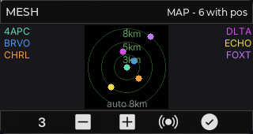
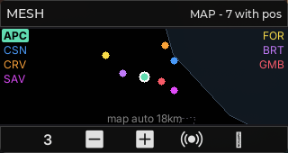
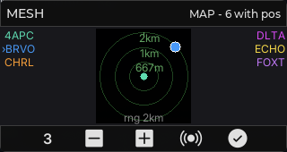
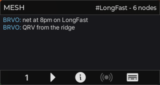
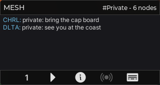
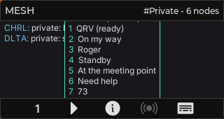
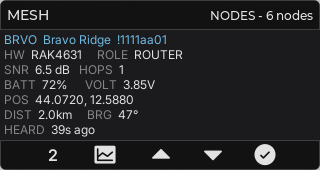

# meshtastic — Meshtastic mesh client

A Meshtastic LoRa-mesh client for the CardputerZero, built on the shared `radio_toolkit`. It is a
**client of a local `meshtasticd` daemon** (Client API over `127.0.0.1:4403`), not a reimplementation of
the radio — see the design docs in [`../../../radio-apps/`](../../../radio-apps/) (`09`, `09a`, `09b`,
`09c`). UI follows the chosen dark theme (`09c`).

## Status

Working (verified on a `meshtasticd -s` bench / scripted peer, both presets host + cp0 aarch64):

- **Connection + handshake** — `MeshtasticClientSource` (`src/net/`): background TCP client, `0x94C3`
  framing, `want_config_id` → `config_complete_id`, resilient reconnect/backoff + heartbeat.
- **Nodes** — `NodeInfo` → `EntityStore`; the NODES view is a themed `lv_table` (SHORT/SNR/HOP/AGE) with
  a green cursor band (keys ▲/▼) and the self node in accent green. Title shows the live node count.
- **Chat receive** — `TEXT_MESSAGE_APP` → `MessageLog`; the CHATS view shows the feed (sender short name
  recoloured: self green, peers info-blue), filtered to the current conversation.
- **Chat send + compose** — the `8` (write) key enters a compose row (raw key capture via
  `platform::set_key_capture`); type, **`Enter` sends and returns**, `Esc` cancels. Sends route to the
  current conversation (channel broadcast or DM peer) and echo to our own feed.
- **ACK color-outline** — `ROUTING_APP` matched by `request_id` updates a sent message's state; the feed
  shows a delivery dot: amber (pending) → green (delivered) / red (failed).
- **Channel switch** — `FromRadio.channel` → `ChannelTable`; the feed/compose target is a *conversation*
  (a channel slot or a DM peer). Key `5` cycles the active channels by name (e.g. `#LongFast` → `#Private`)
  and the title shows the current one. The DM entry point (from a node) lands with Node detail.
- **Canned messages** — key `6` opens a numbered overlay of quick replies; pressing a digit sends that
  preset on the current conversation, `Esc` cancels. Reactions (`7`) are greyed (V2).
- **Map (PPI)** — a north-up radar centred on the self node (or the mesh centroid when self has no fix),
  reusing the ADS-B scope pattern. Range auto-fits all positioned nodes (km rings) with manual zoom on
  keys `5`/`6`; key `7` cycles the selection (white-outlined dot + `›` in the list). Each peer gets a
  distinct colour shared by its radar dot and its **side-column** name — names live beside the scope, not
  on it, since the 320×170 screen is too small for on-canvas labels. Title shows the positioned count.

- **Node detail** — key `8` from the NODES list opens a full-field sub-screen: `SHORT · LONG · id`,
  `HW / ROLE`, `SNR / HOPS`, `BATT / VOLT`, `POS / DIST / BRG` (relative to the self node),
  `HEARD`. Key `5` from the detail starts a DM (opens CHATS filtered to that peer). Key `8` goes back.
  HW model and role decode from the NodeInfo `user.hw_model` / `user.role`; battery and voltage from
  `device_metrics`.

Placeholders / pending: reactions (V2), Tools, Settings.
See `radio-apps/09b` (build order) and `09c` (per-screen design).

## Screenshots

| Map — auto-fit | Map — selection | Map — manual zoom |
| --- | --- | --- |
|  |  |  |

| Chat — channel | Chat — switch (key 5) | Chat — canned (key 6) |
| --- | --- | --- |
|  |  |  |

| Node detail (key 8 from Nodes) |
| --- |
|  |

Captured from the desktop SDL simulator at native 320×170, fed by the scripted Client-API peer (6
positioned nodes around Rimini, two channels). Each peer's radar dot shares its colour with the
side-column name; key `7` selects a node, keys `5`/`6` zoom. In CHATS, key `5` switches channel
(`#LongFast` → `#Private`) and key `6` opens the canned-reply picker.

## Architecture

```
meshtasticd :4403  ──Client API (framed protobuf)──▶  MeshtasticClientSource (reader thread)
                                                          │  on_node → EntityStore.upsert
                                                          │  on_message → MessageLog.add
                                                          │  on_channel → ChannelTable.upsert
                                                          ▼
                                       MeshtasticScreen (UI timer snapshots all) ─▶ Nodes / Chats / Map
```

Protobufs are pre-generated nanopb under `proto/` (vendored; see `proto/PIN.md`) — the build compiles
only C, no protoc/python.

## Build & run (desktop SDL simulator)

```bash
cmake --preset linux-x86-64
cmake --build --preset linux-x86-64-dbg --target meshtastic_app
./build/linux-x86-64/apps/meshtastic/Debug/meshtastic_app   # SDL window, native 320×170
```

Needs a `meshtasticd` on `127.0.0.1:4403` to show data (override with `MESHTASTICD_HOST`/`MESHTASTICD_PORT`):

```bash
docker run -d --name mtd-sim -p 127.0.0.1:4403:4403 \
  meshtastic/meshtasticd:latest meshtasticd -s --fsdir=/var/lib/meshtasticd
```

Keys: `4` cycles the view (Chats→Nodes→Map→Tools→Settings), `5`–`8` are per-view actions, `ESC` quits.

> Note: a single `meshtasticd -s` node has no peer, so no incoming messages appear. To exercise receive,
> use a scripted peer or two nodes (Meshtasticator) — see the `meshtastic-dev-testbench` dev note.
