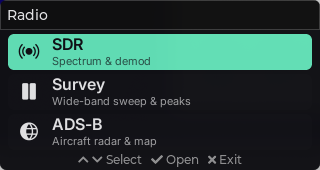

# Radio — the hub launcher for the CardputerZero radio suite (`apps/radio`)

The **Radio** app is a thin **launcher** that gathers the radio suite — **SDR**, **Survey**,
**ADS-B**, **AIS** and **Meshtastic** — behind a single home-screen entry on the
[M5Stack CardputerZero](https://docs.m5stack.com/).
It renders a vertical menu, and when you pick an app it hands the lone display off to that app's
binary (a separate process) and reclaims it when the app exits.

This is **Option A1**: a thin hub that `posix_spawn()`s the existing per-app binaries (`sdr_app`,
`survey_app`, `adsb_app`, `ais_app`, `meshtastic_app`) rather than linking them into one monolith.
The apps stay independent processes — a crash in one cannot take the hub down, and only the changed
binary is rebuilt.

> Status: implemented and verified end-to-end on the desktop SDL simulator at the native device
> resolution (320×170) and on the real CardputerZero — menu navigation, launch, hand-off and
> return all working.



> The hub menu at native 320×170 (desktop SDL simulator): SDR / Survey / ADS-B / AIS / Meshtastic,
> arrow-key navigation, Enter opens, Esc exits to the system launcher.

## Why a single "Radio" entry

APPLauncher's home screen is a flat carousel with no native categories. Rather than scatter five
separate entries across it, the suite ships as one **Radio** hub (`applications/Radio.desktop`); the
hub itself provides the sub-menu. See the suite distribution notes for the launcher/AppStore layout.

## Interaction

- **↑ / ↓** — move the selection (arrow keys; on the device, nav keys `5` / `7` also work).
- **Enter / →** — open the highlighted app.
- **Esc** — leave the hub, back to the system launcher.

The menu is keyboard-driven via the toolkit's `platform::set_key_capture`, so it needs no NavBar.
Arrow-key list navigation is a shared toolkit primitive (`linux_input.cpp` maps `KEY_UP/DOWN/LEFT/RIGHT`
to `LV_KEY_*`), reused by the per-app aircraft/node/ship lists.

## How the display hand-off works

The CardputerZero has a single framebuffer (and the desktop SDL window / remote-fb port is likewise
single-owner), so the hub and a child app cannot both hold it. The flow per launch:

1. The hub renders the menu in one LVGL session (`toolkit::run_app`).
2. On selection, `run_app`'s teardown callback deletes the screen graph, then releases the session —
   every indev, the remote-fb server (freeing its TCP port) and the display — so the framebuffer/port
   is free.
3. The hub `posix_spawn()`s the chosen binary and blocks in `waitpid()`, holding **no** display.
4. When the app exits, the hub **`execv()`s itself** to show the menu again.

The re-exec matters: LVGL + the SDL backend keep static state that is **not** cleanly
re-initialisable in-process (a second `lv_init()` leaves the SDL event pump dead and the window
frozen/unresponsive). A fresh process sidesteps that entirely. The device's fbdev/evdev path has no
such static state, but the same flow applies.

## Binary resolution

`resolve_app_binary()` locates each app's executable, trying in order:

1. `$RADIO_APPS_DIR/<bin>` — explicit dev override.
2. `<hub_dir>/<bin>` — the install layout, where every app binary is colocated under
   `/usr/share/cardputer_radio/bin/`.
3. `<hub_dir>/../../<app_dir>/<config>/<bin>` — the dev CMake build tree, trying the configs
   `Debug`, `Release`, `RelWithDebInfo` in order (`build/<preset>/apps/<app>/<config>/<bin>`),
   so the hub Just Works from a desktop build.

The spawned child inherits the environment, so `REMOTE_FB` / `ADSB_JSON` / `MESHTASTICD_PORT` etc.
propagate straight through. On the device the `.desktop` entry launches the hub through
`applications/radio-launch.sh`, a wrapper that sets device-appropriate SDR defaults
(`SDR_SAMPLE_RATE=1024000`, `SDR_ALSA_DEV=pipewire`, optionally `SDR_RTLTCP`) before exec'ing
`radio_app` — the spawned children inherit those too.

## Adding an app

Append an `AppEntry` to `app_catalog()` in `src/app_catalog.h` (`id`, `name`, `subtitle`, `icon`,
`bin`, `app_dir`). Icons are Phosphor-Fill glyphs from the toolkit's `ui_const.h`. No other change is
needed — the menu, resolution and launch are data-driven. That is how Survey and AIS were added;
further SIGINT apps slot in the same way.

## Build & run

```bash
cmake --preset linux-x86-64 && cmake --build --preset linux-x86-64-dbg --target radio_app
./build/linux-x86-64/apps/radio/Debug/radio_app    # SDL window; needs sibling apps built too
```

Build the whole suite first (`cmake --build --preset linux-x86-64-dbg`) so the hub can resolve the
sibling binaries from the dev tree. For headless dev over remote-fb, set `REMOTE_FB=<port>` — it
propagates to the launched app.

## Layout

```
apps/radio/
  applications/Radio.desktop   # single launcher entry -> /usr/share/cardputer_radio/bin/radio-launch.sh
  applications/radio-launch.sh # device launch wrapper: SDR env defaults, then exec radio_app
  src/
    main.cpp                   # outer flow: render menu -> spawn child -> re-exec
    app_catalog.h              # the suite, in menu order (data-driven)
    launch/app_launcher.{h,cpp}# resolve binary + posix_spawn + waitpid
    viewmodel/hub_viewmodel.{h,cpp}
    view/hub_screen.{h,cpp}    # TitleBar + app list + footer hint, key-capture nav
```
