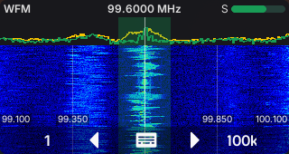
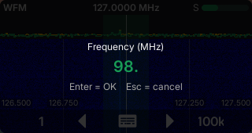
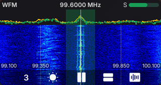

# SDR — a live SDR receiver for the M5Stack CardputerZero (`apps/sdr`)

The **SDR** app turns the [M5Stack CardputerZero](https://docs.m5stack.com/) (a Raspberry-Pi-class
handheld running Linux ARM64, 320×170 RGB565 display, physical keyboard) into a pocket
**software-defined-radio terminal**: a live FFT **spectrum**, a scrolling **waterfall**, and
**real demodulated audio** driven by an RTL-SDR dongle.

It is a graphical [LVGL](https://lvgl.io/) application (not a TUI) built on the shared
**`radio_toolkit`** (the reactive MVVM shell/widgets, extracted from the standalone *SDRTerminal* that
this app was ported from). Development happens on a desktop **SDL simulator** at the exact device
resolution (320×170), fed by a real RTL-SDR over `rtl_tcp`.

> Status (2026-06-21): ported into the cardputer-radio monorepo at feature parity and building green on
> the desktop SDL simulator. Verified end-to-end on hardware with a real **RTL-SDR Blog V4**: live
> spectrum/waterfall and **WFM broadcast audio**.


> Running on the desktop SDL simulator at the native device resolution (320×170), driven by a real
> RTL-SDR Blog V4 — a live WFM broadcast around 99.6 MHz.

## Features

- **Live spectrum + waterfall** — 320-bin FFT line chart over a scrolling RGB565 waterfall
  (black→blue→cyan→yellow→red colormap), full-width, ~30 fps.
- **Real RTL-SDR source** — `RtlTcpSource` connects to a stock `rtl_tcp` server, reads raw IQ in a
  background thread, runs an FFT (FFTW, single precision) and publishes normalized magnitudes with an
  adaptive noise floor. Tuning and zoom **retune the hardware** and crop the FFT window.
- **Real audio demodulation** — in-app `AudioDemod` (fed the same IQ stream) outputs 48 kHz mono via
  SDL on the desktop or **ALSA on the device**: **WFM**, **NFM**, **AM** (envelope + AGC),
  **USB/LSB** (Weaver), **CW**. WFM is verified by ear on both.
- **5-page touchless toolbar** — driven by the 5 physical keys (`4`–`8`) + `ESC`, no pointer needed:
  tuning, zoom/band, visual options, **audio** (mute / volume), **settings** (gain / exit).
- **Passband overlay, peak hold, reference grids** — demod-bandwidth highlight per mode, decaying
  spectrum peak trace (long hold), EMA-smoothed spectrum line, and a vertical frequency grid.
- **Adjustable waterfall/spectrum split** — key `7` on the Visual page cycles the layout presets
  (waterfall 80 / 50 / 0 / 100 % of the plot area).
- **Manual frequency entry** — modal keypad dialog (no LVGL focus group; direct key capture via the
  toolkit's `platform::set_key_capture`).
- **Full session persistence** — VFO, mode, zoom, band, volume/mute, gain, dark mode and grids are
  restored on the next launch (`$XDG_CONFIG_HOME/cardputer_radio/sdr/state`).
- **Mock source fallback** — `SDR_SOURCE=mock` runs a synthetic source with no dongle, for pure UI work.

## How it works

**The signal path, end to end.** An RTL-SDR dongle is plugged into USB and runs the stock `rtl_tcp`
server, which streams raw 8-bit IQ samples over a TCP socket. The app connects to it and, in a
background thread, does two things with the same sample stream so the UI never blocks:

1. **For the display** — it runs an FFT (FFTW) over the IQ, converts the result to magnitudes in dB,
   tracks an adaptive noise floor, and normalizes to a 0–1 range. Each frame becomes one new line at
   the top of the waterfall (which scrolls down) and one trace on the spectrum chart.
2. **For the audio** — it feeds the same IQ to a demodulator that decimates down to 48 kHz and applies
   the right algorithm for the selected mode (FM discriminator for WFM/NFM, envelope for AM, a Weaver
   demodulator for SSB/CW), then plays it through the system audio.

**What you see.** The top header shows the demod **mode** on the left, the tuned **frequency** centred
over a marker line, and an **S-meter** on the right. Below it is the **spectrum** chart, then the
**waterfall** filling the rest of the screen. A translucent green band highlights the **passband**
(the bandwidth actually being demodulated for the current mode), and the waterfall corners and side
grid lines label the band edges.

**How you drive it.** There is no touch or mouse — everything is the five physical keys `4`–`8` plus
`ESC`, mapped to a bottom toolbar. Key `4` cycles through five tool pages (Tuning, Zoom/Band, Visual,
Audio, Settings) and the other four keys act on the current page. **Tuning or zooming retunes the
dongle and re-crops the FFT window in real time**, so the waterfall and the audio follow you immediately.

**It remembers.** Frequency, mode, zoom, band, volume/mute, gain and the display options are saved on
every change and restored the next time you open the app.

## Screenshots

| Spectrum + waterfall | Frequency entry | Visual controls |
| --- | --- | --- |
|  |  |  |

All captured live from a real RTL-SDR Blog V4 (WFM broadcast, ~99.6 MHz) at native 320×170.

## On the CardputerZero device (over the network)

The cross build (`cmake --preset cp0-cross`) enables the full backend:
`SDR_HAVE_RTLTCP` (FFTW + sockets) plus `SDR_HAVE_AUDIO`/`SDR_HAVE_ALSA` — the
demodulated audio plays out of the device speaker through ALSA (the image is
PipeWire-managed, so the default sink is the `pipewire` PCM; see
[`docs/sdr-device-profile.md`](../../docs/sdr-device-profile.md)). The CM0
currently can't host the dongle (no VBUS on the USB-A port — see the project
notes), so the dongle stays on a capable host running `rtl_tcp`, and the device
connects over the LAN:

```shell
# On the host with the dongle:
rtl_tcp -a 0.0.0.0 -p 1234
# On the device (e.g. via the hub, or directly):
SDR_RTLTCP=<host-ip>:1234 SDR_SAMPLE_RATE=1024000 ./sdr_app
```

- `SDR_RTLTCP=host:port` — the rtl_tcp endpoint (default `127.0.0.1:1234`).
- `SDR_SAMPLE_RATE=<hz>` — cap the RTL sample rate (valid: 900k–3.2M or 225k–300k)
  so a weak host drains the stream in real time. The CM0 needs ~1.0 Msps; the stock
  2.4 Msps overruns it (rtl_tcp buffer grows → tuning lag + waterfall jitter).
  This is a **cap**: the effective rate then follows the page-2 zoom span dynamically,
  so narrow spans use lower rates. Retuning flushes the socket so the waterfall jumps
  to the new VFO at once.
- `SDR_ALSA_DEV=<pcm>` — the ALSA output PCM on the device (default `pipewire` via the
  launch wrapper); `SDR_ALSA_CARD` selects a card when using plain ALSA.

**Cross-build prereq:** the BSP sysroot needs the fftw3 dev bits — `fftw3.h` in
`.cache/sdk_bsp-src/usr/include/` and a `libfftw3f.so` symlink next to
`libfftw3f.so.3` in the sysroot lib dir.

## Quick start (desktop, with a real RTL-SDR)

```shell
# 1. Dependencies (Arch shown). The RTL-SDR Blog V4 needs the rtl-sdr-blog driver.
sudo pacman -S --needed cmake ninja sdl2 fmt libpng libjpeg-turbo freetype2 zlib fftw rtl-sdr

# 2. Build the monorepo simulator (from the repo root)
cmake --preset linux-x86-64
cmake --build --preset linux-x86-64-dbg

# 3. Start the RTL-SDR IQ server (plug the dongle first)
rtl_tcp -a 127.0.0.1 -p 1234 -s 2400000   # leave running in another terminal

# 4. Run — the app connects to 127.0.0.1:1234 automatically
./build/linux-x86-64/apps/sdr/Debug/sdr_app
```

Tune to a strong **WFM broadcast** station (toolbar page 2 → band preset, or page 1 → frequency
entry; remember to cycle the mode to **WFM** on page 2) and you should see a strong carrier in the
waterfall and hear the audio.

Environment overrides:

| Variable | Effect |
| --- | --- |
| `SDR_SOURCE=mock` | Use the synthetic source instead of the dongle (no `rtl_tcp` needed). |
| `SDR_RTLTCP=host:port` | Point `RtlTcpSource` at a remote `rtl_tcp` (default `127.0.0.1:1234`). |
| `SDR_FREQ=<hz>` | Start tuned to this frequency, overriding the persisted VFO — this is how the Survey app's **Open in SDR** handoff arrives. |
| `SDR_SAMPLE_RATE=<hz>` | Cap the RTL sample rate (see the device section above). |
| `SDR_ALSA_DEV`, `SDR_ALSA_CARD` | ALSA output PCM / card on the device (default `pipewire`). |

## Controls

The bottom NavBar maps the five physical keys `4`–`8` to five slots. The **leftmost key (`4`)
cycles the tool page** (1→5) and shows the page number; `ESC` quits from any page.

| Key | P1 · Tuning | P2 · Zoom/Band | P3 · Visual | P4 · Audio | P5 · Settings |
| --- | --- | --- | --- | --- | --- |
| `4` | page switch | page switch | page switch | page switch | page switch |
| `5` | tune − | zoom − | dark/light | mute | gain − |
| `6` | **frequency entry** | band preset | freq grid | volume − | gain + |
| `7` | tune + | zoom + | **waterfall/spectrum split** (80/50/0/100 %) | volume + | gain auto / value |
| `8` | coarse/fine (step) | **demod mode** | peak hold | volume % | exit |

The header shows the demod mode (left), the tuned frequency centred over the waterfall marker, and an
S-meter (right).

## Architecture

Reactive MVVM with a one-way data flow; the UI observes LVGL *subjects* and never reads state directly.
The shell (key routing, NavBar, BaseScreen, reactive bindings, theme, assets, run loop) is the shared
`radio_toolkit`; only the SDR-specific pieces live in this app.

```
input (keys 4-8 + ESC) → key router (toolkit platform/linux_input)
   ├─ 4..8  → NavBar slot → NavProvider::nav_activate(page,slot) → SdrViewModel action → SdrModel + publish subject
   ├─ ESC   → quit handler (toolkit run_app)
   └─ capture → while the frequency dialog is open, every key goes to it

live data (independent of input):
   RTL-SDR ──rtl_tcp(TCP IQ)──▶ RtlTcpSource (reader thread)
                                   ├─ FFT (FFTW) ─▶ shared magnitudes ─▶ next_frame() ─▶ chart + waterfall
                                   └─ AudioDemod  ─▶ demod per mode ─▶ SDL (desktop) / ALSA (device) audio (48 kHz)
   lv_timer (~33 ms) → SpectrumScreen::tick(): set_tuning/mode/volume/gain, pull a frame, draw
```

SDR-specific files (`apps/sdr/src/`):

- **`sdr/spectrum_source.{h,cpp}`** — the `SpectrumSource` interface the UI depends on
  (`next_frame`, `set_tuning`, `set_mode`, `set_volume/muted`, `set_gain`) plus `MockSpectrumSource`.
- **`sdr/rtl_tcp_source.{h,cpp}`** — real source: `rtl_tcp` client + FFTW spectrum + hardware
  retuning and zoom-following adaptive sample rate. fftw/SDL kept out of the header via pImpl;
  gated by `SDR_HAVE_RTLTCP` (desktop and cross build).
- **`sdr/audio_demod.{h,cpp}`** — multi-mode demodulator (decimating FIRs, FM discriminator, AM
  envelope, Weaver SSB/CW, AGC) with SDL (desktop) or ALSA (device) audio output.
- **`view/spectrum_screen.{h,cpp}`** — the SDR screen: header, chart, waterfall (colormap from the
  toolkit's shared `view::raster`), passband, grids, frequency dialog (on the toolkit's `BaseScreen`).
- **`model/sdr_model.{h,cpp}` / `viewmodel/sdr_viewmodel.{h,cpp}`** — radio state (VFO in Hz, mode,
  span, bands, audio, gain, v4 persistence) and the reactive subjects/actions, bridging onto the
  toolkit's `ShellViewModel` + `NavProvider`.

Everything else (reactive bindings, NavBar/IconButton/TitleBar, key routing, theme, asset manager,
run loop) is reused unchanged from `radio_toolkit`.

## Build

CMake ≥ 3.31, C++17. The desktop build links **FFTW3 (single precision)** and **threads** for the real
source; without FFTW it falls back to the mock (the `SDR_HAVE_RTLTCP` define is set automatically when
`fftw3f` + SDL2 are found). The app is built as part of the monorepo:

```shell
cmake --preset linux-x86-64
cmake --build --preset linux-x86-64-dbg   # → build/linux-x86-64/apps/sdr/Debug/sdr_app
# release: cmake --build --preset linux-x86-64-rel
```

> **Editor note:** clang in-editor may report false positives (`lvgl.h not found`, `lv_subject_t
> unknown`) because it doesn't see CMake's include paths. The source of truth is `cmake --build`.

The cross build (`cp0-cross`) enables the same real source (fftw3f from the BSP sysroot) plus ALSA
audio when `libasound` is found; without fftw3f the app falls back to the mock. `.deb` packaging is
a monorepo-wide concern.

## Known limitations

- NFM/AM/SSB/CW audio is implemented but **not yet verified by ear** — in a high-noise RF environment
  with a short antenna, only WFM comes through clearly. The demod code is correct in theory but needs a
  better antenna/location (or a networked dongle) to confirm.
- Waterfall frequency labels show 3 decimals (1 kHz resolution); the header keeps 4 decimals, so 100 Hz
  fine tuning shows on the header but not on the waterfall scale.
- The RTL-SDR dongle cannot yet plug into the device itself (USB-A VBUS hardware issue under
  investigation); use a networked `rtl_tcp` host in the meantime.

## Roadmap

- Verify NFM/AM/SSB/CW audio with a proper antenna / quieter RF environment (WFM is confirmed).
- Settings page: sample rate, bias-tee, ppm correction (gain is done).
- HackRF front-end via SoapySDR (RTL-SDR v3/v4 and compatible dongles supported today).
- On-device `.deb` deployment.

## License

MIT. See the repo `assets/` folder for third-party asset license notes.
