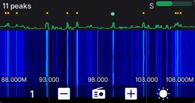

# survey — Spectrum Survey

A wide-band spectrum survey for the CardputerZero (radio-apps
[`10a`](../../../radio-apps/10a-spectrum-survey-source-plan.md)): sweep tens-to-hundreds of MHz,
see **what is transmitting**, and hand a signal off to the SDR app to listen. Where `sdr_app` is
a *microscope* (one ≤2.4 MHz tune you already know), Survey is the *panorama* — the "survey the
band, find the peaks, drill in" tool the suite was missing. Built on the shared `radio_toolkit`,
it reuses the SDR app's waterfall pipeline verbatim; the only new engine is the sweep source.



## How it works

A **sweep** produces a wide frequency-axis magnitude frame — far wider than one tuner sees — by
shelling out to `rtl_power` (RTL-SDR, ≤~1.7 GHz) or `hackrf_sweep` (HackRF, →6 GHz) and parsing
their CSV stdout. That frame has the same shape as the SDR app's FFT frame, so the waterfall,
colormap, chart and S-meter are reused unchanged.

```
rtl_power / hackrf_sweep  ──CSV stdout──▶  SweepAccumulator (pure parser + stitch)
                                              │  frame_dbm()  -> normalized waterfall row
                                              │  peaks()      -> PEAKS list
                                              ▼
                    CsvSweepSource (worker thread, respawn) ─▶ SurveyScreen (waterfall / peaks)
```

The parser (`src/sweep/sweep_accumulator.{h,cpp}`) is a **pure** library — no subprocess, sockets
or LVGL — covered by a frozen two-source parity test (`test/sweep_parser_test.cpp`, 13 vectors
including a real captured FM-band sweep; the python oracle `test/gen_sweep_vectors.py` implements
the same contract independently). The live `CsvSweepSource` mirrors the SDR app's resilient
`RtlTcpSource`: a worker thread owns the child process and pipe, publishes the latest frame under
a mutex, and respawns with backoff if the tool dies.

## Screens

- **Waterfall** (page 1) — the wide-band scope: spectrum chart + scrolling RGB565 waterfall over
  the swept range, with **frequency labels and vertical reference lines** at ¼ / ½ / ¾ of the
  span (plus the band edges) and a **yellow dot on every detected peak**; the currently selected
  peak's dot is drawn larger in the accent colour. Keys: `5`/`7` zoom out/in, `6` opens the
  **tune dialog** (type a centre frequency then a total span in MHz — `Enter` advances then
  commits, `Esc` cancels; the window becomes centre ± span/2), `8` toggles theme. The range
  persists across runs.
- **Peaks** (page 2) — "who is transmitting": a themed table **FREQ MHz | POWER | AGE** with an
  accent selection band (keys `5`/`6` move the cursor). Key `8` **cycles the sort** through the
  three columns ascending/descending (the header shows e.g. `PWR v`, the nav button the short
  code). Key `7` — **Open in SDR** — launches `sdr_app` tuned to the selected peak via `SDR_FREQ`.

## Build & run (desktop SDL simulator)

```bash
cmake --preset linux-x86-64
cmake --build --preset linux-x86-64-dbg --target survey_app
./build/linux-x86-64/apps/survey/Debug/survey_app     # SDL window, native 320x170
```

Needs `rtl_power` (from `rtl-sdr`) or `hackrf_sweep` (from `hackrf`) on `PATH` and a dongle.
Environment:

- `SURVEY_SOURCE=mock` — synthetic sweep (drifting carriers), no tools/hardware needed.
- `SURVEY_SOURCE=hackrf` — use `hackrf_sweep` instead of the default `rtl_power`.

> The RTL-SDR is opened by the survey process while it runs — do not run a second `rtl_power`
> against the same dongle at the same time (double-open resets some RTL2838 units off the USB bus).

## Testing

```bash
ctest --test-dir build/linux-x86-64 -C Debug -R sweep_parser_test
```

The parser test is the frozen reward: it is not edited to make code pass. Regenerate the vectors
(e.g. to add a new captured sweep at `test/fm_capture.csv`) with `python3 test/gen_sweep_vectors.py`.

## Status / next

V1 ships the sweep source, the waterfall, the PEAKS list with sort, and the SDR handoff, verified
on a real RTL-SDR V4 over the FM broadcast band. Not yet: an in-process step-sweep backend (faster
narrow RTL surveys, `SweepSource` stays the interface), a DF-meter mode, and on-device packaging.
