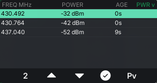

# Scanner (`apps/survey`) — wide-band spectrum sweep

The **Scanner** app is part of **ZeroRadio 1.0.0** for the CardputerZero. It sweeps tens to hundreds
of MHz, shows **what is transmitting**, and hands a signal to the SDR app for listening. The SDR app
is a *microscope* on one tune of up to 2.4 MHz. The Scanner is the *panorama*: survey the band, find
the peaks, drill in. The source directory and binary keep the name `survey` (`apps/survey`,
`survey_app`). The UI and the hub show it as **Scanner**.

It is built on the shared `radio_toolkit` and reuses the SDR app's waterfall pipeline (the
`view::raster` colormap and the chart code). The only new engine is the sweep source.

| Waterfall (FM band, real RTL-SDR) | Peaks list |
| --- | --- |
|  |  |

## How it works

A **sweep** builds one wide magnitude frame, far wider than a single tuner sees. The app runs
`rtl_power` (RTL-SDR, up to ~1.7 GHz) or `hackrf_sweep` (HackRF, up to 6 GHz) and parses their CSV
output. It starts the tool when it opens and stops it on exit. The frame has the same shape as the
SDR app's FFT frame, so the waterfall, colormap, chart and S-meter work unchanged.

```
rtl_power / hackrf_sweep  ──CSV stdout──▶  SweepAccumulator (pure parser + stitch)
                                              │  frame_dbm()  -> normalized waterfall row
                                              │  peaks()      -> PEAKS list
                                              ▼
                    CsvSweepSource (worker thread, respawn) ─▶ SurveyScreen (waterfall / peaks)
```

The parser (`src/sweep/sweep_accumulator.{h,cpp}`) is a **pure** library with no subprocess,
sockets or LVGL. A frozen two-source parity test covers it (`test/sweep_parser_test.cpp`, 13 vectors
including a real captured FM-band sweep). The python oracle `test/gen_sweep_vectors.py` implements
the same contract on its own. The live `CsvSweepSource` owns the child process and pipe on a worker
thread. It publishes the latest frame under a mutex and respawns the tool with backoff if it dies.

## Screens

- **Waterfall** (page 1) — the wide-band scope: a spectrum chart and a scrolling RGB565 waterfall
  over the swept range. **Vertical reference lines** mark ¼, ½ and ¾ of the span, with frequency
  labels on those lines and on the band edges. A **yellow dot marks every detected peak**, and the
  selected peak's dot is larger, in the accent colour. Keys: `5`/`7` zoom out/in, `8` toggles the
  theme. Key `6` opens the **tune dialog**: type a centre frequency, then a total span in MHz.
  `Enter` advances and then commits, `Esc` cancels. The window becomes centre ± span/2, and the app
  saves it for the next run.
- **Peaks** (page 2) — "who is transmitting": a table **FREQ MHz | POWER | AGE** with an accent
  selection band. Keys `5`/`6` move the cursor. Key `8` **cycles the sort** through the three columns,
  descending and ascending. The header shows the full name (e.g. `PWR v`) and the nav button a short
  code. Key `7` (**Open in SDR**) quits the Scanner and starts `sdr_app` tuned to the selected peak
  through `SDR_FREQ`. The rest of the environment passes through, and the dongle moves to the SDR app.

Global keys, shared by every ZeroRadio app:

- `Esc` — back to the hub. Hold `Esc` for 3 s to return to the system launcher.
- `H` — open the in-app help ([`docs/help/survey.md`](../../docs/help/survey.md)).
- `F`/`X` (up/down) — move the Peaks cursor.
- `TAB` — switch to the SDR app.

## Build & run

Desktop SDL simulator:

```bash
cmake --preset linux-x86-64
cmake --build --preset linux-x86-64-dbg --target survey_app
./build/linux-x86-64/apps/survey/Debug/survey_app     # SDL window, native 320x170
```

It needs `rtl_power` (from `rtl-sdr`) or `hackrf_sweep` (from `hackrf`) on `PATH`, and a dongle. On
the CardputerZero the dongle plugs into the USB-A port, and the `zeroradio` `.deb` pulls in both
tools. Device builds use `scripts/cp0-docker-build.sh` (Debian trixie container, preset
`cp0-trixie`). `scripts/cp0-docker-build.sh --package` produces the `.deb`, which installs to
`/usr/share/zeroradio`.

Environment:

- `SURVEY_SOURCE=mock` — a synthetic sweep (drifting carriers), with no tools or hardware.
- `SURVEY_SOURCE=hackrf` — use `hackrf_sweep` instead of the default `rtl_power`.

> The Scanner holds the RTL-SDR while it runs. Do not run a second `rtl_power` against the same
> dongle at the same time: a double open resets some RTL2838 units off the USB bus.

The app saves its state in `~/.config/zeroradio/survey/`.

## Testing

```bash
ctest --test-dir build/linux-x86-64 -C Debug -R sweep_parser_test
```

The parser test is the frozen reward: nobody edits it to make code pass. To add a new captured sweep
at `test/fm_capture.csv`, regenerate the vectors with `python3 test/gen_sweep_vectors.py`.

## Next

An in-process step-sweep backend for faster narrow RTL surveys (`SweepSource` stays the interface),
and a DF-meter mode.
